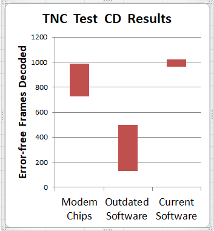
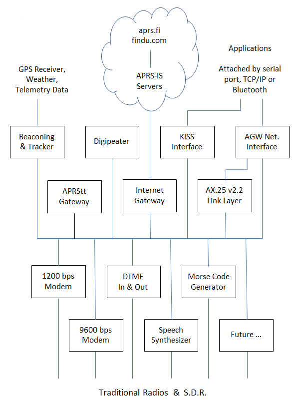

# Dire Wolf #

### Decoded Information from Radio Emissions for Windows Or Linux Fans ###

In the early days of Amateur Packet Radio, it was necessary to use an expensive “Terminal Node Controller” (TNC) with specialized hardware.  Those days are gone.  You can now get better results at lower cost by connecting your radio to the “soundcard” interface of a computer and using software to decode the signals.

Why settle for mediocre receive performance from a 1980's technology  TNC using an old modem chip?   Dire Wolf decodes over 1000 error-free frames from Track 2 of the [WA8LMF TNC Test CD](https://github.com/wb2osz/direwolf/tree/dev/doc/WA8LMF-TNC-Test-CD-Results.pdf), leaving all the hardware TNCs, and first generation "soundcard" modems, behind in the dust.

 
Dire Wolf is a modern software replacement for the old 1980's style TNC built with special hardware.

Without any additional software, it can perform as:

 - APRS GPS Tracker
 - Digipeater
 - Internet Gateway (IGate)
- [APRStt](http://www.aprs.org/aprstt.html) gateway

It can also be used as a virtual TNC for other applications such as [APRSIS32](http://aprsisce.wikidot.com/), [UI-View32](http://www.ui-view.net/), [Xastir](http://xastir.org/index.php/Main_Page), [APRS-TW](http://aprstw.blandranch.net/), [YAAC](http://www.ka2ddo.org/ka2ddo/YAAC.html), [UISS](http://users.belgacom.net/hamradio/uiss.htm), [Linux AX25](http://www.linux-ax25.org/wiki/Main_Page), [SARTrack](http://www.sartrack.co.nz/index.html), [Winlink Express (formerly known as RMS Express, formerly known as Winlink 2000 or WL2K)](http://www.winlink.org/RMSExpress), [BPQ32](http://www.cantab.net/users/john.wiseman/Documents/BPQ32.html), [Outpost PM](http://www.outpostpm.org/), and many others.
 
 
## Features & Benefits ##

### Dire Wolf includes: ###

- **Beaconing, Tracker, Telemetry Toolkit.**

     Send periodic beacons to provide information to others.  For tracking the location is provided by a GPS receiver.
     Build your own telemetry applications with the toolkit.

- **APRStt Gateway.**

     Very few hams have portable equipment for APRS but nearly everyone has a handheld radio that can send DTMF tones.  APRStt allows a user, equipped with only DTMF (commonly known as Touch Tone) generation capability, to enter information into the global APRS data network.  Responses can be sent by Morse Code or synthesized speech.

- **Digipeaters for APRS and traditional Packet Radio.**

    Extend the range of other stations by re-transmitting their signals. Unmatched flexibility for cross band repeating and filtering to limit what is retransmitted.

- **Internet Gateway (IGate).**

    IGate stations allow communication between disjoint radio networks by allowing some content to flow between them over the Internet.

- **AX.25 v2.2 Link Layer.**

    Traditional connected mode packet radio where the TNC automatically retries transmissions and delivers data in the right order.

- **KISS Interface (TCP/IP, serial port, Bluetooth) & AGW network Interface (TCP/IP).**

    Dire Wolf can be used as a virtual TNC for applications such as   APRSIS32,           UI-View32, Xastir, APRS-TW,YAAC, UISS, Linux  AX25, SARTrack, Winlink / RMS Express, Outpost PM, and many others.  

### Radio Interfaces:   ###

- **Uses computer’s “soundcard” and digital signal processing.**

    Lower cost and better performance than specialized hardware. 

    Compatible interfaces include [UDRC](https://nw-digital-radio.groups.io/g/udrc/wiki/UDRC%E2%84%A2-and-Direwolf-Packet-Modem), [SignaLink USB](http://www.tigertronics.com/slusbmain.htm), [DMK URI](http://www.dmkeng.com/URI_Order_Page.htm), [RB-USB RIM](http://www.repeater-builder.com/products/usb-rim-lite.html), [RA-35](http://www.masterscommunications.com/products/radio-adapter/ra35.html), and many others.

- **Standard 300, 1200 & 9600 bps modems and more.**

- **DTMF (“Touch Tone”) Decoding and Encoding.**
 
- **Speech Synthesizer & Morse code generator.**

    Transmit human understandable messages.

- **Compatible with Software Defined Radios such as gqrx, rtl_fm, and SDR#.**

- **Concurrent operation with up to 3 soundcards and 6 radios.**

### Portable & Open Source:   ###

- **Runs on Windows, Linux (PC/laptop, Raspberry Pi, etc.), Mac OSX.**

## Documentation ##

[Stable Version](https://github.com/wb2osz/direwolf/tree/master/doc)

[Latest Development Version](https://github.com/wb2osz/direwolf/tree/dev/doc)

[Power Point presentation](https://github.com/wb2osz/direwolf-presentation)  -- Why not give a talk at a local club meeting?

## Installation ##

### Windows ###

Go to the [**releases** page](https://github.com/wb2osz/direwolf/releases).   Download a zip file with "win" in its name, unzip it, and run direwolf.exe from a command window.

For more details see the **User Guide** in the [**doc** directory](https://github.com/wb2osz/direwolf/tree/master/doc).  

### Linux - Using git clone (recommended) ###

***Note that this has changed for version 1.6.  There are now a couple extra steps.***

A standard operating system install will probably include these already:

- git
- gcc or clang compiler
- make

You will probably need to install additional packages:

On Debian / Ubuntu / Raspbian:

    sudo apt-get install cmake
    sudo apt-get install libasound2-dev
    sudo apt-get install libudev-dev

Or on Red Hat / Fedora / Centos:

    sudo yum install cmake
    sudo yum install alsa-lib-devel
    sudo yum install libudev-devel

Then on any flavor of Linux:

	cd ~
	git clone https://www.github.com/wb2osz/direwolf
	cd direwolf
	mkdir build && cd build
	cmake ..
	make –j4
	sudo make install
	make install-conf

This should give you the most recent stable release.  If you want the latest (possibly unstable) development version, use "git checkout dev" after the "cd direwolf" command.

For more details see the **User Guide** in the [**doc** directory](https://github.com/wb2osz/direwolf/tree/master/doc).  Special considerations for the Raspberry Pi are found in **Raspberry-Pi-APRS.pdf**

### Linux - Using apt-get (Debian flavor operating systems) ###

Results will vary depending on your hardware platform and operating system version because it depends on various volunteers who perform the packaging.  

	sudo apt-get update
	apt-cache showpkg direwolf
	sudo apt-get install direwolf

### Linux - Using yum (Red Hat flavor operating systems) ###

Results will vary depending on your hardware platform and operating system version because it depends on various volunteers who perform the packaging.  

	sudo yum check-update
	sudo yum list direwolf
	sudo yum install direwolf

### Linux - Download source in tar or zip file ###

Go to the [releases page](https://github.com/wb2osz/direwolf/releases).  Chose desired release and download the source as zip or compressed tar file.  Unpack the files, with "unzip" or "tar xfz," and then:

	cd direwolf-*
	mkdir build && cd build
	cmake ..
	make –j4
	sudo make install
	make install-conf

For more details see the **User Guide** in the [**doc** directory](https://github.com/wb2osz/direwolf/tree/master/doc).  Special considerations for the Raspberry Pi are found in **Raspberry-Pi-APRS.pdf**

### Macintosh OS X ###

Read the **User Guide** in the [**doc** directory](https://github.com/wb2osz/direwolf/tree/master/doc).   It is a lot more complicated than Linux.  

If you have problems,  post them to the [Dire Wolf packet TNC](https://groups.yahoo.com/neo/groups/direwolf_packet/info) discussion group.   I don't have a Mac and probably won't be able to help you.  I rely on others, in the user community, for the Mac version.

## Join the conversation  ##
 
Here are some good places to ask questions and share your experience:

- [Dire Wolf Software TNC](https://groups.io/g/direwolf) 

- [Raspberry Pi 4 Ham Radio](https://groups.io/g/RaspberryPi-4-HamRadio)

- [linuxham](https://groups.io/g/linuxham)

- [TAPR aprssig](http://www.tapr.org/pipermail/aprssig/)
 

The github "issues" section is for reporting software defects and enhancement requests.  It is NOT a place to ask questions or have general discussions.  Please use one of the locations above.
